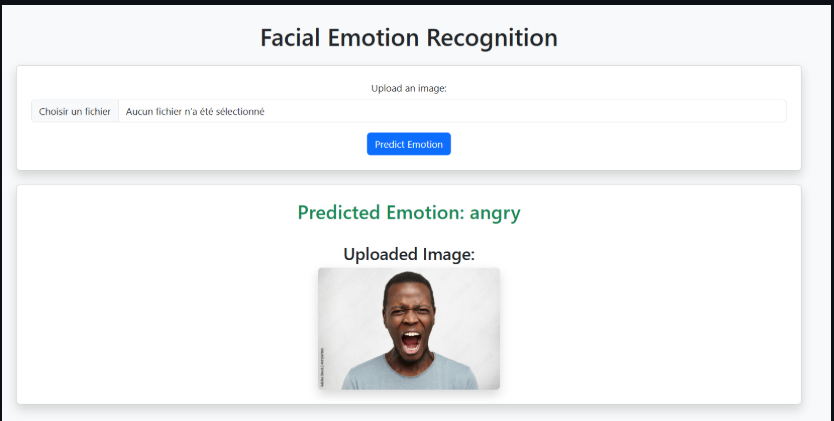

#  Facial Emotion Recognition with EfficientNetV2M and Attention Mechanisms — *AffectNet Case Study*  

**Description:**  
Developed a deep learning model for **Facial Emotion Recognition (FER)** based on **EfficientNetV2M** architecture, enhanced with attention mechanisms for improved feature focus and model interpretability.  
The system classifies four primary emotions — **Happiness, Sadness, Fear, and Anger** — using the large-scale AffectNet dataset.  

**Key Features:**  
- Fine-tuned **EfficientNetV2M** on AffectNet with integrated attention modules  
- Applied regularization techniques (dropout, batch normalization) to enhance model stability  
- Designed multi-output architecture with **early exits** for adaptable inference speed  
- Achieved **79.3% validation accuracy** after fine-tuning with attention  
- Addressed interpretability through visual attention maps on facial regions  

**Technical Approach:**  
- Transfer learning using ImageNet-pretrained EfficientNetV2M  
- Attention-based feature refinement  
- Early exits for intermediate classification with dynamic inference  
- Hyperparameter tuning with learning rate scheduling and early stopping  
- Categorical cross-entropy loss with per-output tracking  

**Dataset:**  
- AffectNet (subset of 4 emotions)  
- Training set: 80%, Validation set: 20%, Test set: Hold-out  
- Managed class imbalance through targeted data sampling  

**Evaluation Metrics:**  
- Accuracy, F1-Score, Loss Curves  
- Performance validated on unseen AffectNet samples  

**Results Highlights:**  
- Training Accuracy: **96.1%**  
- Validation Accuracy: **79.3%**  
- Validation Loss: **0.53** at best epoch

**Tech stack:** Python, TensorFlow/Keras, EfficientNetV2M, AffectNet Dataset  

**Sample Prediction Result:**  

  
*Example of a facial emotion recognition prediction on unseen data — the model correctly identified the emotion based on key facial features.*  
